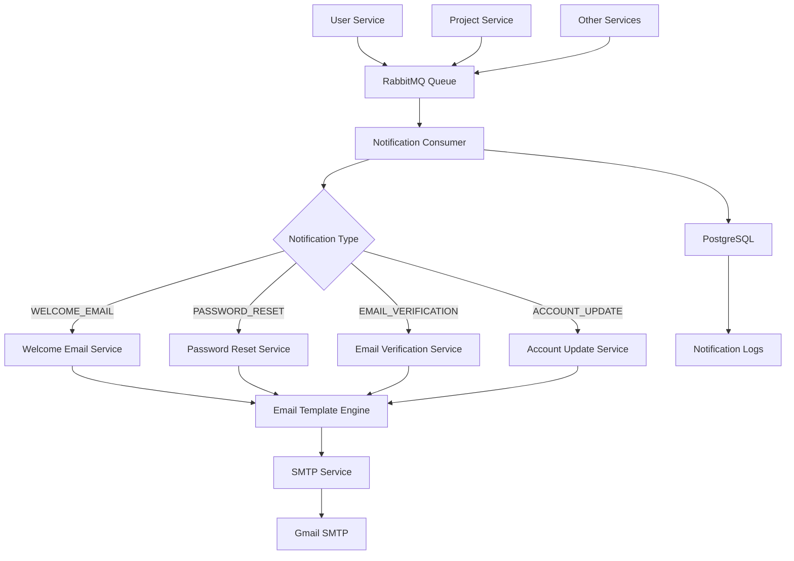

<div align="center">
  <h1>📧 ScholarAI Notification Service</h1>
  <p><strong>Real-time Email & Messaging Microservice</strong></p>
  
  [](https://spring.io/projects/spring-boot)
  [](https://www.rabbitmq.com/)
  [](https://www.postgresql.org/)
  [](https://www.thymeleaf.org/)

  <p>Asynchronous notification service for the ScholarAI platform. Handles email delivery, template processing, and real-time messaging with RabbitMQ integration.</p>

  [Quick Start](#-quick-start) · [API Documentation](#-api-endpoints) · [Templates](#-email-templates) · [Configuration](#-configuration)
</div>

---

## ✨ **Core Features**

### 📨 **Email Delivery System**
- **Multi-Template Support**: Welcome emails, password resets, email verification, account updates
- **HTML Email Templates**: Professional Thymeleaf-based email designs with responsive layouts
- **SMTP Integration**: Gmail SMTP with app password authentication
- **Template Variables**: Dynamic content injection with custom data
- **Delivery Tracking**: Email send status and error handling

### 🐰 **Asynchronous Messaging**
- **RabbitMQ Integration**: Message queue-based notification processing
- **Event-Driven Architecture**: Decoupled notification handling
- **Message Persistence**: Reliable message delivery with queue durability
- **Dead Letter Handling**: Failed message processing and retry mechanisms
- **JSON Message Format**: Standardized notification request structure

### 🗄️ **Data Management**
- **PostgreSQL Database**: Persistent storage for notification logs and templates
- **Flyway Migration**: Database versioning and schema management
- **JPA/Hibernate**: Object-relational mapping with validation
- **Connection Pooling**: Optimized database connection management

### 🔧 **Production Ready**
- **Health Monitoring**: Actuator endpoints for service health checks
- **Metrics Collection**: Prometheus-compatible metrics export
- **Service Discovery**: Eureka client registration and discovery
- **Docker Support**: Containerized deployment with health checks
- **Code Quality**: Spotless formatting and MapStruct object mapping

---

## 🚀 **Quick Start**

### Prerequisites
- **Java 21+** (OpenJDK recommended)
- **Maven 3.8+** for building
- **PostgreSQL 15+** for data persistence
- **RabbitMQ 3.11+** for message queuing
- **Gmail Account** with app password for email delivery
- **Service Registry** running on port 8761

### 🛠️ **Local Development**

1. **Clone and Build**
   ```bash
   git clone https://github.com/Javafest2025/notification-service.git
   cd notification-service
   ./mvnw clean install
   ```

2. **Database Setup**
   ```bash
   # Create PostgreSQL database
   createdb notificationDB
   
   # Or using Docker
   docker run --name notification-postgres \
     -e POSTGRES_DB=notificationDB \
     -e POSTGRES_USER=notif_user \
     -e POSTGRES_PASSWORD=notif_pass \
     -p 5434:5432 -d postgres:15
   ```

3. **RabbitMQ Setup**
   ```bash
   # Using Docker
   docker run --name notification-rabbitmq \
     -e RABBITMQ_DEFAULT_USER=rabbit_user \
     -e RABBITMQ_DEFAULT_PASS=rabbit_pass \
     -p 5672:5672 -p 15672:15672 \
     -d rabbitmq:3-management
   ```

4. **Environment Configuration**
   ```bash
   cp env.example .env
   ```
   
   Configure your `.env` file:
   ```env
   # Database
   NOTIFICATION_DB_USER=notif_user
   NOTIFICATION_DB_PASSWORD=notif_pass
   
   # RabbitMQ
   RABBITMQ_USER=rabbit_user
   RABBITMQ_PASSWORD=rabbit_pass
   
   # Gmail SMTP
   GMAIL_ADDRESS=your-email@gmail.com
   GMAIL_APP_PASSWORD=your-app-password
   
   # Service Discovery
   EUREKA_CLIENT_SERVICEURL_DEFAULTZONE=http://localhost:8761/eureka/
   ```

5. **Run the Service**
   ```bash
   ./mvnw spring-boot:run -Dspring-boot.run.profiles=local
   ```
   
   🌐 **Service Health:** `http://localhost:8082/actuator/health`
   📚 **API Documentation:** `http://localhost:8082/swagger-ui.html`

### 🐳 **Docker Deployment**

#### Using Docker Compose (Recommended)
```bash
# Start notification service with dependencies
docker-compose up -d

# View logs
docker-compose logs -f notification-service

# Stop services
docker-compose down
```

#### Using Docker Scripts
```bash
# Build and start
./scripts/docker.sh up

# View logs
./scripts/docker.sh logs

# Check health
./scripts/docker.sh health

# Stop service
./scripts/docker.sh stop
```

#### Manual Docker Commands
```bash
# Build image
docker build -t scholar-notification-service .

# Run with dependencies
docker run -d --name scholar-notification-service \
  -p 8082:8082 \
  -e SPRING_PROFILES_ACTIVE=docker \
  -e NOTIFICATION_DB_USER=notif_user \
  -e NOTIFICATION_DB_PASSWORD=notif_pass \
  -e RABBITMQ_USER=rabbit_user \
  -e RABBITMQ_PASSWORD=rabbit_pass \
  -e GMAIL_ADDRESS=your-email@gmail.com \
  -e GMAIL_APP_PASSWORD=your-app-password \
  --network scholarai-network \
  scholar-notification-service
```

---

## 🏗️ **Architecture**

### 📡 **Message Flow**



### 🔄 **Notification Types**

| Type | Description | Template | Trigger |
|------|-------------|----------|---------|
| **WELCOME_EMAIL** | New user registration | `welcome-email.html` | User signup |
| **PASSWORD_RESET** | Password reset request | `password-reset-email.html` | Forgot password |
| **EMAIL_VERIFICATION** | Email address verification | `email-verification.html` | Account creation |
| **ACCOUNT_UPDATE** | Account changes notification | Coming soon | Profile updates |

### 🛡️ **Data Models**

```java
// NotificationRequest DTO
{
  "notificationType": "WELCOME_EMAIL",
  "recipientEmail": "user@example.com",
  "recipientName": "John Doe",
  "timestamp": "2024-01-15T10:30:00Z",
  "templateData": {
    "userName": "John",
    "activationLink": "https://scholarai.com/activate/token123"
  }
}
```

---

## 📋 **Configuration**

### 🏠 **Local Development (`application-local.yml`)**
```yaml
spring:
  datasource:
    url: jdbc:postgresql://localhost:5434/notificationDB
    username: ${NOTIFICATION_DB_USER}
    password: ${NOTIFICATION_DB_PASSWORD}
  
  rabbitmq:
    host: localhost
    port: 5672
    username: ${RABBITMQ_USER}
    password: ${RABBITMQ_PASSWORD}
  
  mail:
    host: smtp.gmail.com
    port: 587
    username: ${GMAIL_ADDRESS}
    password: ${GMAIL_APP_PASSWORD}
    properties:
      mail.smtp:
        auth: true
        starttls.enable: true
        ssl.trust: smtp.gmail.com
```

### 🐳 **Docker Environment (`application-docker.yml`)**
```yaml
spring:
  datasource:
    url: jdbc:postgresql://notification-db:5432/notificationDB
    username: ${NOTIFICATION_DB_USER}
    password: ${NOTIFICATION_DB_PASSWORD}
  
  rabbitmq:
    host: user-rabbitmq
    port: 5672
    username: ${RABBITMQ_USER}
    password: ${RABBITMQ_PASSWORD}

eureka:
  client:
    service-url:
      defaultZone: http://service-registry:8761/eureka/
  instance:
    prefer-ip-address: true
    hostname: notification-service
```

### ⚙️ **RabbitMQ Configuration**
```yaml
rabbitmq:
  notification:
    queue:
      name: notification-queue
    exchange:
      name: notification-exchange
    routing:
      key: notification-routing-key
```

### 🔧 **Environment Variables**

| Variable | Description | Default |
|----------|-------------|---------|
| `SPRING_PROFILES_ACTIVE` | Active Spring profile | `local` |
| `NOTIFICATION_DB_USER` | PostgreSQL username | - |
| `NOTIFICATION_DB_PASSWORD` | PostgreSQL password | - |
| `RABBITMQ_USER` | RabbitMQ username | - |
| `RABBITMQ_PASSWORD` | RabbitMQ password | - |
| `GMAIL_ADDRESS` | Gmail account for SMTP | - |
| `GMAIL_APP_PASSWORD` | Gmail app password | - |
| `EUREKA_CLIENT_SERVICEURL_DEFAULTZONE` | Eureka server URL | `http://localhost:8761/eureka/` |

---

## 📧 **Email Templates**

### 🎨 **Template Structure**
All email templates are located in `src/main/resources/templates/` and use Thymeleaf for dynamic content:

#### **Welcome Email** (`welcome-email.html`)
```html
<!DOCTYPE html>
<html xmlns:th="http://www.thymeleaf.org">
<head>
    <title>Welcome to ScholarAI</title>
    <meta charset="UTF-8">
    <meta name="viewport" content="width=device-width, initial-scale=1.0">
</head>
<body>
    <h1>Welcome <span th:text="${userName}">User</span>!</h1>
    <p>Thank you for joining ScholarAI. Get started with your research journey.</p>
    <a th:href="${activationLink}">Activate Your Account</a>
</body>
</html>
```

#### **Password Reset** (`password-reset-email.html`)
```html
<h1>Password Reset Request</h1>
<p>Hi <span th:text="${userName}">User</span>,</p>
<p>Click the link below to reset your password:</p>
<a th:href="${resetLink}">Reset Password</a>
<p>This link expires in 24 hours.</p>
```

#### **Email Verification** (`email-verification.html`)
```html
<h1>Verify Your Email</h1>
<p>Hi <span th:text="${userName}">User</span>,</p>
<p>Please verify your email address:</p>
<a th:href="${verificationLink}">Verify Email</a>
```

### 📊 **Template Variables**

| Template | Variables | Description |
|----------|-----------|-------------|
| **welcome-email** | `userName`, `activationLink` | User name and account activation |
| **password-reset** | `userName`, `resetLink`, `expiryTime` | Password reset with expiry |
| **email-verification** | `userName`, `verificationLink` | Email verification link |

### 🖼️ **Assets and Styling**
- **Logo**: `src/main/resources/images/logo.png`
- **CSS**: Inline styles for email client compatibility
- **Responsive**: Mobile-friendly email layouts
- **Branding**: ScholarAI color scheme and typography

---

## 📊 **API Endpoints**

### 🔍 **Health & Management**

| Endpoint | Method | Description |
|----------|--------|-------------|
| `/actuator/health` | GET | Service health status |
| `/actuator/info` | GET | Application information |
| `/actuator/metrics` | GET | Application metrics |
| `/actuator/prometheus` | GET | Prometheus metrics |

### 📧 **Email Testing (Development)**

| Endpoint | Method | Description |
|----------|--------|-------------|
| `/api/v1/email/test/welcome` | POST | Send test welcome email |
| `/api/v1/email/test/password-reset` | POST | Send test password reset |
| `/api/v1/email/test/verification` | POST | Send test verification email |

### 🐰 **Message Queue Integration**

The service primarily receives messages through RabbitMQ queues:

#### **Queue Configuration**
- **Queue Name**: `notification-queue`
- **Exchange**: `notification-exchange`
- **Routing Key**: `notification-routing-key`
- **Message Format**: JSON with `NotificationRequest` structure

#### **Message Example**
```json
{
  "notificationType": "WELCOME_EMAIL",
  "recipientEmail": "john.doe@example.com",
  "recipientName": "John Doe",
  "timestamp": "2024-01-15T10:30:00Z",
  "templateData": {
    "userName": "John",
    "activationLink": "https://scholarai.com/activate/abc123"
  }
}
```

### 🧪 **Testing Endpoints**

#### Send Test Welcome Email
```bash
curl -X POST http://localhost:8082/api/v1/email/test/welcome \
  -H "Content-Type: application/json" \
  -d '{
    "recipientEmail": "test@example.com",
    "recipientName": "Test User",
    "templateData": {
      "userName": "Test",
      "activationLink": "https://scholarai.com/activate/test123"
    }
  }'
```

#### Health Check
```bash
curl http://localhost:8082/actuator/health
```

**Response:**
```json
{
  "status": "UP",
  "components": {
    "db": {
      "status": "UP",
      "details": {
        "database": "PostgreSQL",
        "validationQuery": "isValid()"
      }
    },
    "rabbit": {
      "status": "UP",
      "details": {
        "version": "3.11.0"
      }
    },
    "mail": {
      "status": "UP",
      "details": {
        "location": "smtp.gmail.com:587"
      }
    }
  }
}
```

---

## 🔧 **Development & Testing**

### 🧪 **Running Tests**

```bash
# Unit tests
./mvnw test

# Integration tests
./mvnw verify

# Build with tests and code formatting
./mvnw clean package

# Skip formatting checks (development)
./mvnw clean package -Dspotless.check.skip=true
```

### 🐛 **Testing Email Delivery**

1. **Setup Gmail App Password**
   ```bash
   # Enable 2FA on Gmail account
   # Generate app password: Google Account > Security > App passwords
   # Use app password in GMAIL_APP_PASSWORD environment variable
   ```

2. **Test RabbitMQ Integration**
   ```bash
   # Send message to queue (using RabbitMQ management UI)
   # Or programmatically from other services
   
   # Check RabbitMQ management console
   open http://localhost:15672
   ```

3. **Database Testing**
   ```bash
   # Connect to PostgreSQL
   psql -h localhost -p 5434 -U notif_user -d notificationDB
   
   # Check notification logs
   SELECT * FROM notification_logs ORDER BY created_at DESC LIMIT 10;
   ```

### 📊 **Performance Testing**

```bash
# Load test email endpoint
ab -n 100 -c 5 -p test-email.json -T application/json \
  http://localhost:8082/api/v1/email/test/welcome

# Monitor queue performance
rabbitmqctl list_queues name messages consumers
```

### 🔍 **Debugging**

```yaml
# Enable debug logging
logging:
  level:
    org.solace.scholar_ai.notification_service: DEBUG
    org.springframework.amqp: DEBUG
    org.springframework.mail: DEBUG
    org.thymeleaf: DEBUG
```

---

## 🚀 **Production Deployment**

### 🌐 **Multi-Instance Setup**

```yaml
# docker-compose.prod.yml
version: '3.8'
services:
  notification-service-1:
    image: scholar-notification-service:latest
    environment:
      - INSTANCE_ID=notification-1
      - SERVER_PORT=8082
      
  notification-service-2:
    image: scholar-notification-service:latest
    environment:
      - INSTANCE_ID=notification-2
      - SERVER_PORT=8083
```

### 🔒 **Security Configuration**

```yaml
# Secure email configuration
spring:
  mail:
    properties:
      mail.smtp:
        auth: true
        starttls.enable: true
        ssl.trust: smtp.gmail.com
        connectiontimeout: 5000
        timeout: 3000
        writetimeout: 5000
```

### 📊 **Performance Tuning**

```yaml
# Database connection pooling
spring:
  datasource:
    hikari:
      minimum-idle: 5
      maximum-pool-size: 20
      idle-timeout: 300000
      max-lifetime: 1800000
      connection-timeout: 20000

# RabbitMQ optimization
spring:
  rabbitmq:
    listener:
      simple:
        concurrency: 3
        max-concurrency: 10
        prefetch: 5
```

### 📧 **Email Provider Alternatives**

```yaml
# SendGrid Configuration
spring:
  mail:
    host: smtp.sendgrid.net
    port: 587
    username: apikey
    password: ${SENDGRID_API_KEY}

# AWS SES Configuration
spring:
  mail:
    host: email-smtp.us-east-1.amazonaws.com
    port: 587
    username: ${AWS_SES_USERNAME}
    password: ${AWS_SES_PASSWORD}
```

---

## 🔍 **Troubleshooting**

### 🚨 **Common Issues**

#### Email Not Sending
```bash
# Check Gmail app password
echo $GMAIL_APP_PASSWORD

# Verify SMTP configuration
curl -v telnet://smtp.gmail.com:587

# Check email service logs
docker logs scholar-notification-service | grep -i mail
```

#### RabbitMQ Connection Issues
```bash
# Check RabbitMQ status
rabbitmqctl status

# Verify queue configuration
rabbitmqctl list_queues

# Check connection from service
curl http://localhost:8082/actuator/health/rabbit
```

#### Database Connection Problems
```bash
# Test PostgreSQL connection
pg_isready -h localhost -p 5434

# Check database credentials
psql -h localhost -p 5434 -U notif_user -d notificationDB

# Verify Flyway migrations
./mvnw flyway:info
```

#### Template Rendering Issues
```bash
# Check template location
ls -la src/main/resources/templates/

# Verify Thymeleaf configuration
grep -r thymeleaf src/main/resources/application*.yml

# Test template with sample data
curl -X POST http://localhost:8082/api/v1/email/test/welcome
```

### 📋 **Health Check Failures**

```bash
# Service health
curl -v http://localhost:8082/actuator/health

# Component-specific health
curl http://localhost:8082/actuator/health/db
curl http://localhost:8082/actuator/health/rabbit
curl http://localhost:8082/actuator/health/mail

# Check service registration
curl http://localhost:8761/eureka/apps/NOTIFICATION-SERVICE
```

### 🔧 **Debug Mode**

```yaml
# Enable comprehensive debugging
logging:
  level:
    root: INFO
    org.solace.scholar_ai.notification_service: DEBUG
    org.springframework.amqp.rabbit: DEBUG
    org.springframework.mail: DEBUG
    org.thymeleaf: DEBUG
    org.hibernate.SQL: DEBUG
```

---

## 🤝 **Contributing**

### 🚀 **Development Setup**
1. Fork the repository
2. Create a feature branch (`git checkout -b feature/amazing-feature`)
3. Setup local PostgreSQL and RabbitMQ
4. Configure Gmail app password for testing
5. Make your changes and add tests
6. Run the test suite (`./mvnw test`)
7. Test email delivery functionality
8. Commit your changes (`git commit -m 'Add amazing feature'`)
9. Push to the branch (`git push origin feature/amazing-feature`)
10. Open a Pull Request

### 📋 **Coding Standards**
- Follow Spring Boot conventions
- Use Lombok for boilerplate reduction
- Apply Spotless code formatting
- Add comprehensive tests for new features
- Update email templates for UI changes
- Document environment variables

### 🐛 **Reporting Issues**
- Use the GitHub issue tracker
- Provide detailed reproduction steps
- Include service logs and email delivery status
- Specify email provider and template used

---

## 📄 **License**

This project is licensed under the **MIT License** - see the [LICENSE.md](LICENSE.md) file for details.

---

## 🙏 **Acknowledgments**

- **Spring Boot Team** for the comprehensive framework
- **RabbitMQ Team** for reliable message queuing
- **Thymeleaf Team** for excellent template engine
- **Gmail SMTP** for reliable email delivery
- **Community Contributors** for feedback and improvements

---

<div align="center">
  <p><strong>Built with 📧 for seamless communication in the ScholarAI ecosystem</strong></p>
  <p>
    <a href="http://localhost:8082/swagger-ui.html">API Docs</a> •
    <a href="http://localhost:8082/actuator">Actuator</a> •
    <a href="http://localhost:15672">RabbitMQ Console</a> •
    <a href="https://github.com/Javafest2025/notification-service/issues">Support</a>
  </p>
</div>
